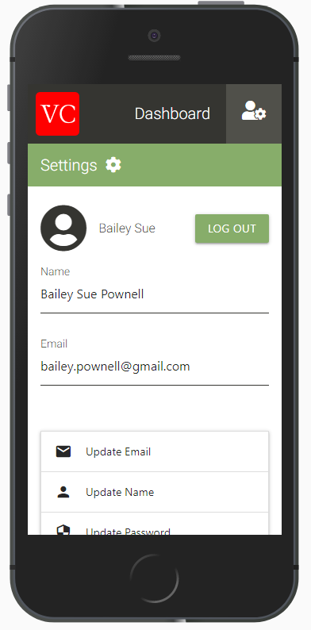
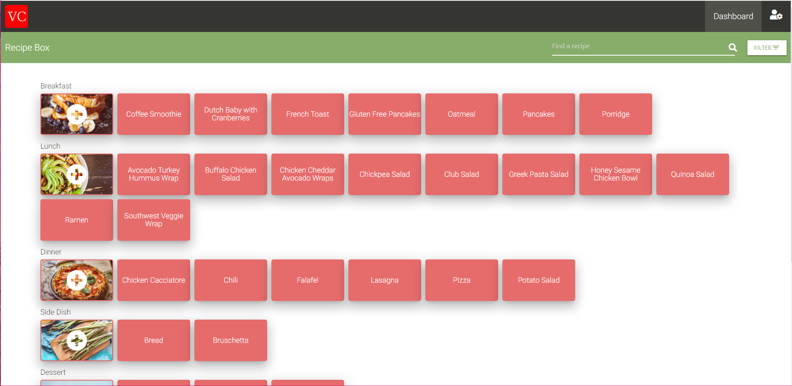
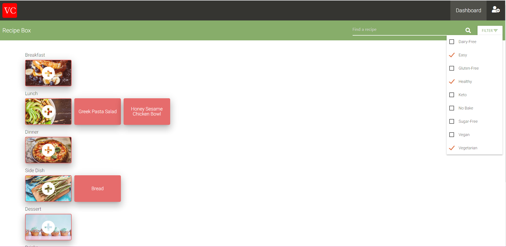

# recipe-stash

### A Web App to store all of your recipes

It's a common problem for many internet chefs; you find a recipe you want to try, pin it on Pinterest.com, come back 6 months later and find that the domain for the recipe no longer exists. Or you try something you really love, write it down on a recipe card to put in your recipe box, and then think to yourself "What if my house burned down? I wouldn't even have this anymore." Or maybe you got halfway through and thought "This is too much work".

Well that's because it is.

What you need is a single place for all of your recipes that isn't subject to the forces of the physical world; and the best part is no more handwriting---you can just copy and paste.

##### This web app gives users the ability to create recipes and attach files, categorize recipes by specific categories, and tag recipes by characteristics such as sugar-free, gluten-free, and vegan. A WYSIWYG text editor provides for a smooth user experience, and integration with AWS S3 provides the ability to upload images.

#### Built with React, material-ui, RxJS, Node, & PostgreSQL.

## [Visit the web app](https://recipe-stash-1.herokuapp.com/)

