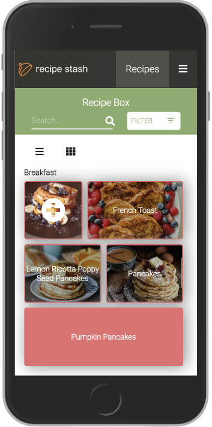
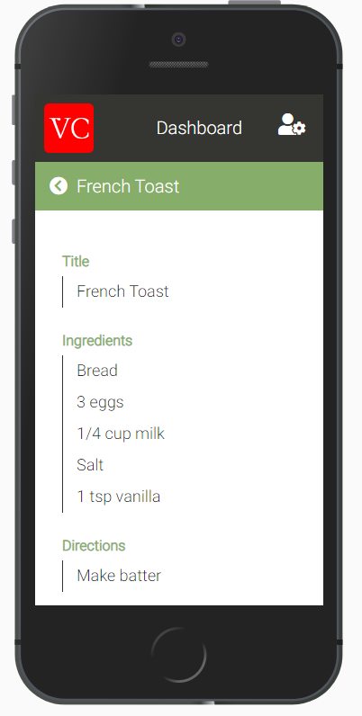
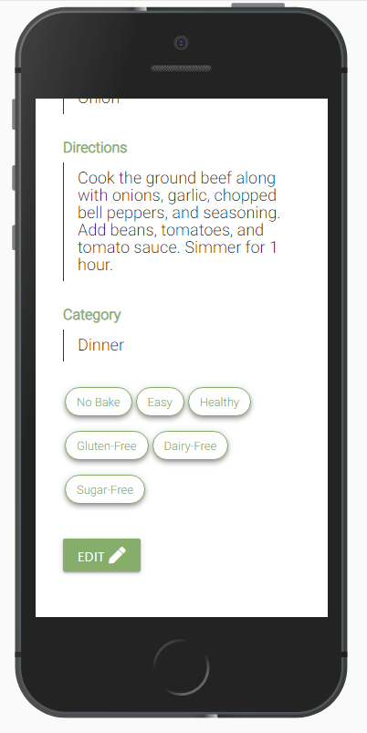
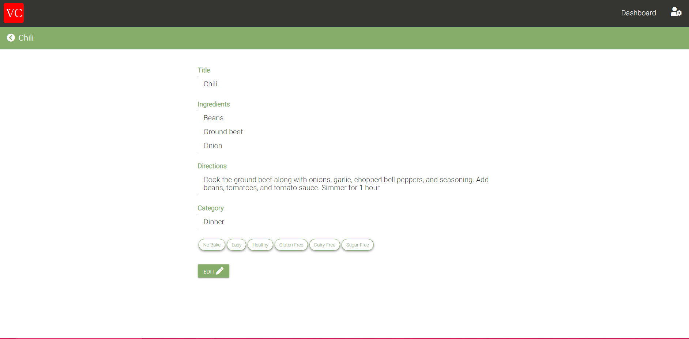

# Virtual-Cookbook

### A Web App to store all of your recipes

It's a common problem for many internet chefs; you find a recipe you want to try, pin it on Pinterest.com, come back 6 months later and find that the domain for the recipe no longer exists. Or you try something you really love, write it down on a recipe card to put in your recipe box, and then think to yourself "What if my house burned down? I wouldn't even have this anymore." Or maybe you got halfway through and thought "This is too much work".

Well that's because it is.

And the answer isn't pinning recipes on a website that may not even exist in 20 years (Pinterest). What you need is a single place for all of your recipes that isn't subject to the forces of the physical world; and the best part is no more handwriting---you can just copy and paste.

#### Built with React, MaterializeCSS, RxJS, Node, & PostgreSQL.

## [Visit the web app](https://glacial-savannah-05736.herokuapp.com/login)

