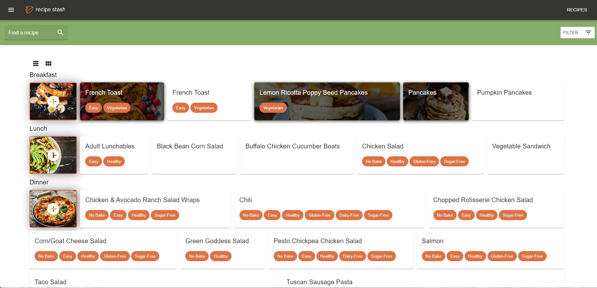
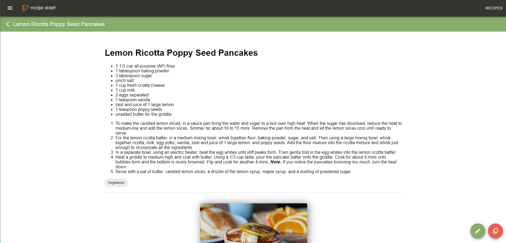

# recipe-stash

### A web app to store all of your recipes

##### This web app gives users the ability to create recipes and attach files, categorize recipes by specific categories, and tag recipes by characteristics such as sugar-free, gluten-free, and vegan.

#### Built with React, material-ui, RxJS, Node, & PostgreSQL.

## [Visit the web app](https://recipe-stash-1.herokuapp.com/)

